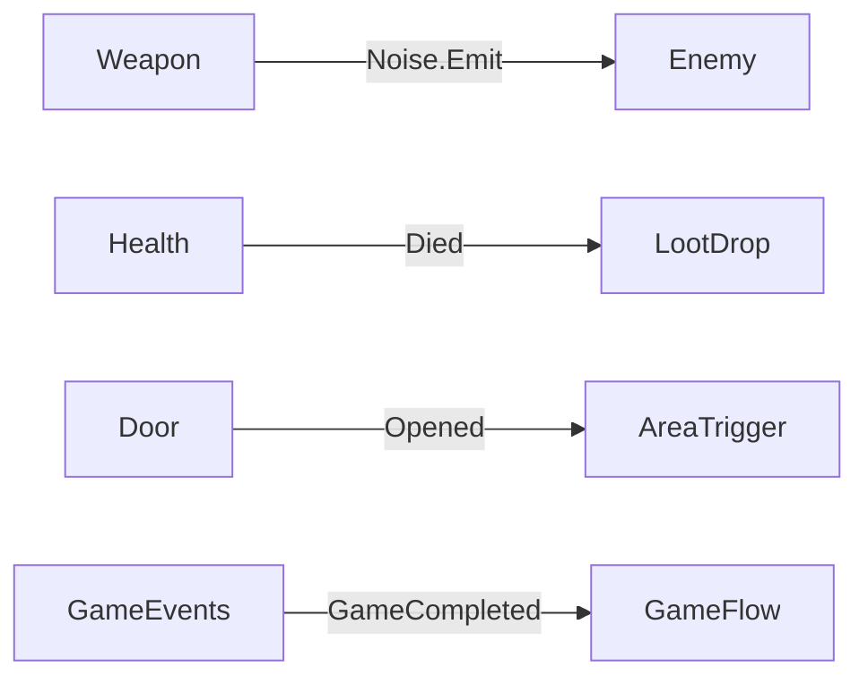

# The structure map

Every worker and reviewer otherwise rebuilds its picture of the game by reading code: which
systems exist, how they talk, which builder makes which asset. That costs tokens on every task
and still misses things. One short committed document replaces most of that reading, and gives
the user an overview of the game at a glance.

Create it after the first accepted task, as `Docs/GameStructure.md` or wherever the project keeps
its docs. From then on every task brief says to update it, and review treats a stale map as a
finding: when an event or contract changes, the map changes in the same task.

Keep it to about 200 lines. It says how the game fits together; `STRUCTURE.md`, if there is one,
already says where files go.

~~~markdown
# Game structure

## Systems

<one line per system: assembly, key components, what it owns>

## Builders
| Builder | Generates | Runs after |
|---|---|---|
| SandboxBuilder | Sandbox.unity | - |
| EnemyBuilder | Enemy prefabs | SandboxBuilder |

## Level
<areas, doors and keys, the critical path from start to finish>

## Tests
| Fixture | Proves |
|---|---|
| MovementTests | Walk, jump, slope limits |
| PlaythroughTest | The level can be finished |
~~~

Omit a section the game does not have yet. A map that describes systems that do not exist is
worse than no map.
